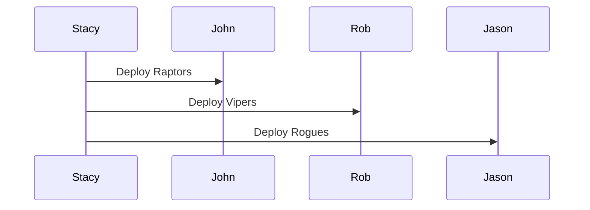

# prompt_fury
meow

| KEY | CHAPTER |
| --- | --- |
| S1FX | CHAPTER ONE |
| S1EX | CHAPTERS TWO THREE FOUR FIVE SIX TEN |
| S1HX | CHAPTER NINE |

```
Use PyPDF2
```


```mermaid
sequenceDiagram
Stacy->>John: Deploy Raptors
Stacy->>Rob: Deploy Vipers
Stacy->>Jason: Deploy Rogues
```

